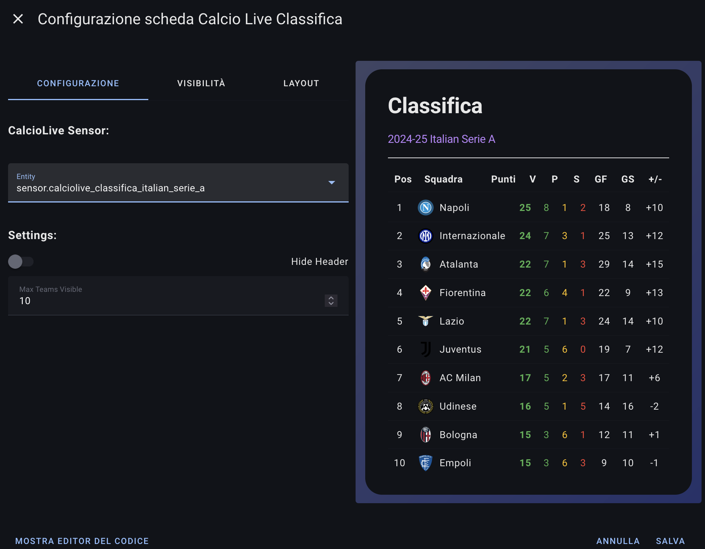
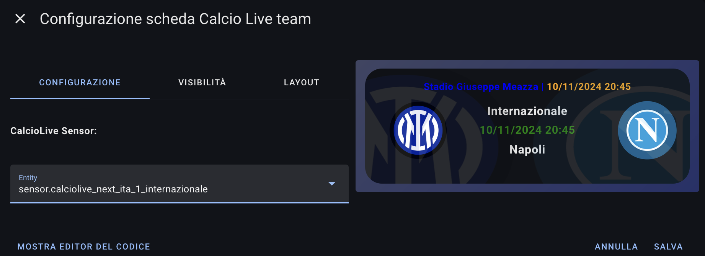
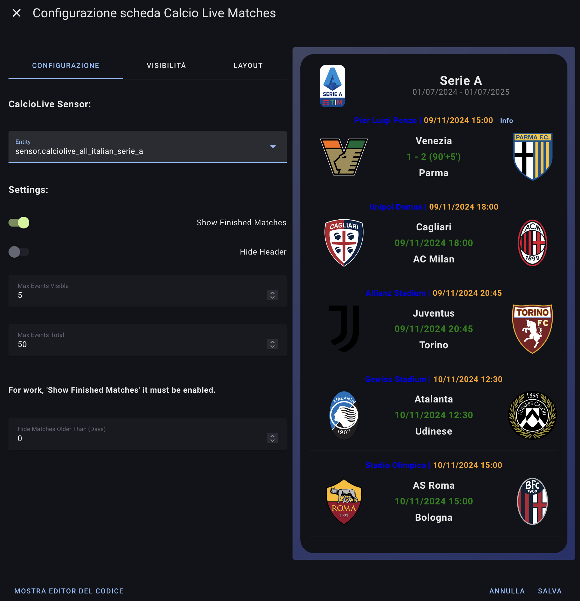

# ⚽ Soccer Live Card

Beautiful, animated football cards for Home Assistant.  
Companion for the [Soccer Live integration](https://github.com/rononline/soccerlive).

Originally based on [Calcio Live Card](https://github.com/Bobsilvio/calcio-live-card) by @Bobsilvio — extended with multi-language support, new cards, themes and various improvements.

---

## ✨ Cards

| Card | Type | Shows |
|---|---|---|
| 🏅 **Standings** | `soccer-live-classifica` | League table with coloured zones (CL / EL / relegation), gold for #1 |
| ⚽ **Team** | `soccer-live-team` | Match: live score, form pills, season record, top scorer, TV channel, attendance |
| 📋 **Matches** | `soccer-live-matches` | Day-grouped matches with live highlighting and FT badge |
| 📰 **News** | `soccer-live-news` | Article feed with images and relative timestamps |
| 👥 **Lineup** | `soccer-live-lineup` | Starting eleven for both teams, formation, shirt numbers |
| ⏱ **Timeline** | `soccer-live-timeline` | Minute-by-minute log (goals, cards, substitutions) |
| 🏆 **Bracket** | `soccer-live-bracket` | Knockout bracket: list view or tournament tree with trophy |
| 🥇 **Top Scorers** | `soccer-live-cannonieri` | Top scorers list with photo, team logo and goal tally |

### Features
- 🌍 **Multi-language** — EN / NL / DE / PT / FR / ES / IT, auto-detected via HA locale
- 🎨 **Animations** — live pulse, score pop, goal confetti + banner
- 🔔 **In-card toasts** — optional on goals and cards, no notification spam
- 🏆 **Bracket** — list style or tournament tree with SVG connector lines
- 🎨 **Themes** — `dark`, `light`, `feyenoord`, `classic`, `neon`, `gold`
- 📱 **Responsive** — works on mobile, tablet and desktop

---

## 📸 Screenshots

| Standings | Team | Matches |
|---|---|---|
|  |  |  |

---

## 📦 Installation via HACS

1. Add the repository as a **custom repository** in HACS:  
   `https://github.com/rononline/soccerlive-card` — category: **Dashboard**
2. Install **Soccer Live Card** via HACS
3. Restart Home Assistant and do a hard refresh of the dashboard (Ctrl+F5 / Cmd+Shift+R)

> Make sure the [Soccer Live integration](https://github.com/rononline/soccerlive) is installed.

---

## 🃏 Card reference

All cards share two common options:

| Option | Description |
|---|---|
| `entity` | The Soccer Live sensor. The editor auto-filters compatible sensors. |
| `language` | Force language: `auto` (follows HA locale), `en`, `nl`, `de`, `pt`, `fr`, `es`, `it` |
| `skin` | `dark` (default), `light`, `feyenoord`, `classic`, `neon`, `gold` |

### 🏅 Standings

```yaml
type: custom:soccer-live-classifica
entity: sensor.soccerlive_classifica_ned_1
max_teams_visible: 18
hide_header: false
show_event_toasts: false
```

### ⚽ Team

```yaml
type: custom:soccer-live-team
entity: sensor.soccerlive_next_ned_1_feyenoord_rotterdam
show_event_toasts: true
score_size: normal    # normal / big / huge
```

With `show_event_toasts: true`, a goal triggers a full celebration:
confetti burst, flashing card border, large "GOAL!" banner, score animation and vibration on mobile.

### 📋 Matches

```yaml
type: custom:soccer-live-matches
entity: sensor.soccerlive_all_ned_1
max_events_visible: 6
max_events_total: 50
show_finished_matches: true
hide_past_days: 0
show_event_toasts: false
```

### 📰 News

```yaml
type: custom:soccer-live-news
entity: sensor.soccerlive_news_ned_1
max_articles: 5
hide_images: false
```

### 👥 Lineup

```yaml
type: custom:soccer-live-lineup
entity: sensor.soccerlive_next_ned_1_feyenoord_rotterdam
```

> Available shortly before kick-off (once ESPN publishes the lineups).

### ⏱ Timeline

```yaml
type: custom:soccer-live-timeline
entity: sensor.soccerlive_next_ned_1_feyenoord_rotterdam
reverse_order: true   # newest on top
```

### 🏆 Bracket

```yaml
type: custom:soccer-live-bracket
entity: sensor.soccerlive_bracket_uefa_champions
style: tree           # 'list' (default) or 'tree'
compact: false
tree_show_playoffs: false
```

The bracket sensor is created automatically for cup competitions:  
Champions League, Europa League, Conference League, FA Cup, Copa del Rey, World Cup, Euros, and more.

### 🥇 Top Scorers

```yaml
type: custom:soccer-live-cannonieri
entity: sensor.soccerlive_cannonieri_ned_1
max_items: 10
hide_header: false
```

The top scorers sensor (`soccerlive_cannonieri_*`) is created automatically for every competition sensor.  
Shows: rank, player photo, name, team logo and goal tally.

> Not all competitions provide top scorer data via ESPN. If the sensor shows `Not available`, the competition does not support this endpoint.

---

## 🌍 Multi-language

All UI text is translated via `src/i18n.js` with **90+ keys** in seven languages.

| Key | EN | NL | DE | PT | FR | ES | IT |
|---|---|---|---|---|---|---|---|
| `time.today` | Today | Vandaag | Heute | Hoje | Aujourd'hui | Hoy | Oggi |
| `event.goal` | Goal | Doelpunt | Tor | Gol | But | Gol | Goal |
| `round.r16` | Round of 16 | Achtste finales | Achtelfinale | Oitavas | Huitièmes | Octavos | Ottavi |
| `status.halftime` | Halftime | Rust | Halbzeit | Intervalo | Mi-temps | Descanso | Intervallo |

---

## 📜 License

GPL-3.0 — see [LICENSE](LICENSE).  
Data via ESPN public APIs.
